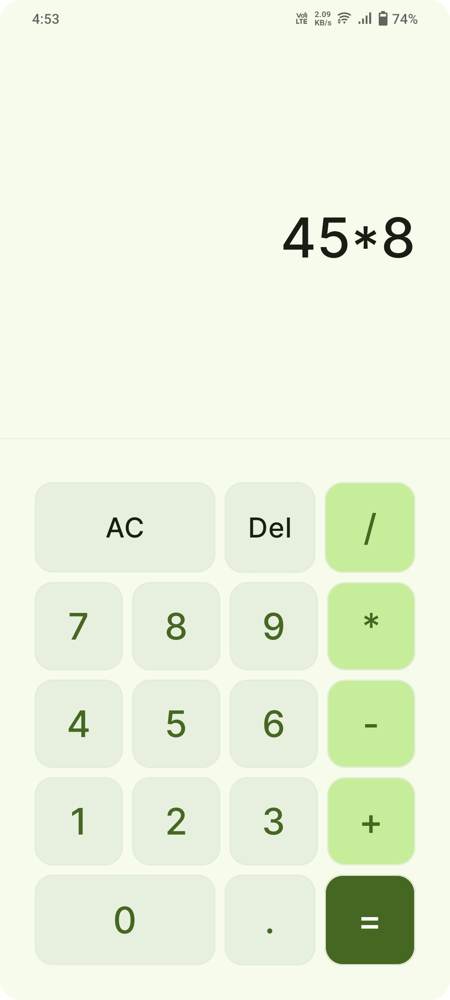

# Calculator App
A simple calculator app built using Jetpack Compose and Material 3 system design from Google.

## Features
- Automatic light/dark mode with dynamic color
- Small app size less than 1.5 mb
- Adaptive icon
- No unnecessary permissions needed

## Requirements
- Android Studio Jellyfish | 2023.3.1
- Min SDK 28
- Target SDK 34
- AGP 8.4.1
- JDK 17
- Kotlin 1.9.22

## Dependencies
- [Lifecycle ViewModel Compose](https://mvnrepository.com/artifact/androidx.lifecycle/lifecycle-viewmodel-compose)
- [Accompanist System UI Controller Library (Deprecated)](https://mvnrepository.com/artifact/com.google.accompanist/accompanist-systemuicontroller)

## Preview

## Download
